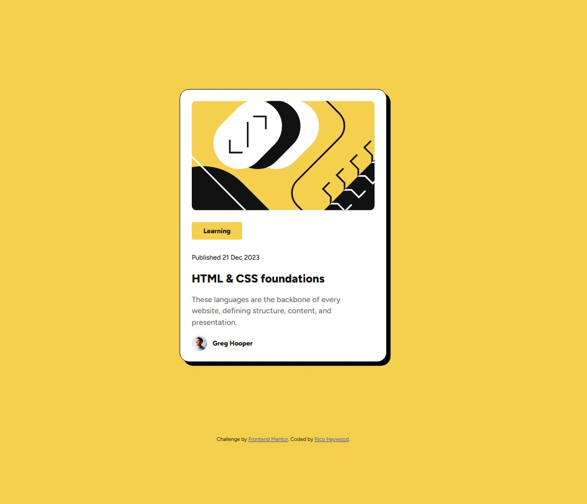

# Frontend Mentor - Blog preview card solution

This is a solution to the [Blog preview card challenge on Frontend Mentor](https://www.frontendmentor.io/challenges/blog-preview-card-ckPaj01IcS). Frontend Mentor challenges help you improve your coding skills by building realistic projects. 

## Table of contents

- [Overview](#overview)
  - [The challenge](#the-challenge)
  - [Screenshot](#screenshot)
- [My process](#my-process)
  - [Built with](#built-with)
  - [What I learned](#what-i-learned)
  - [Continued development](#continued-development)
  - [Useful resources](#useful-resources)

## Overview

### The challenge

Users should be able to:

- See hover and focus states for all interactive elements on the page

### Screenshot



## My process

### Built with

- Semantic HTML5 markup
- CSS custom properties
- Flexbox
- CSS Grid

### What I learned

Use this section to recap over some of your major learnings while working through this project. Writing these out and providing code samples of areas you want to highlight is a great way to reinforce your own knowledge.

To see how you can add code snippets, see below:

```html
<div class="card-blog">
          <p class="card-blog-date">Published 21 Dec 2023</p>
          <h2 class="card-blog-heading">HTML & CSS foundations</h2>
          <p class="card-blog-comments">
            These languages are the backbone of every website, defining
            structure, content, and presentation.
          </p>
        </div>
      </div>
```
```css
.card-category {
  display: flex;
  justify-content: center;
  align-items: center;
  width: 82px;
  height: 29px;
  gap: 8px;
  background-color: #f4d04e;
  padding: 4px 12px;
  border-radius: 4px;
}
.card-category:hover,
.card-blog-heading:hover,
.card-profile {
  cursor: pointer;
}
.card-blog-label {
  font-weight: 800;
  font-size: 14px;
}
.card-blog-date {
  font-weight: 500;
  font-size: 14px;
}
.card-blog-heading {
  font-weight: 800;
  font-size: 24px;
}
```

### Continued development

I learned how to utilize figma to develop wireframes and utilize the developer tools to understand and structure the html and css code.
I need to do continued research to understand how/when to use flex elements vs grid elements; and how to implement media queries to adapt to screen sizes.

### Useful resources

- [Video: Figma Tutorial: Device Frames and Scrolling](https://www.youtube.com/watch?v=ST6DOO11zuA) - While in an indirect relation to the challenge, this tutrial helped me to gain a deeper understanding of Frames, Components, and Prototyping in figma.
