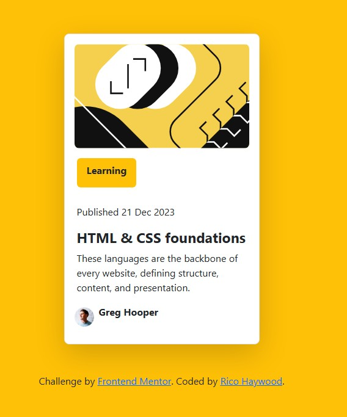

# Frontend Mentor - Blog preview card solution

This is a solution to the [Blog preview card challenge on Frontend Mentor](https://www.frontendmentor.io/challenges/blog-preview-card-ckPaj01IcS). Frontend Mentor challenges help you improve your coding skills by building realistic projects. 

## Table of contents

- [Overview](#overview)
  - [The challenge](#the-challenge)
  - [Screenshot](#screenshot)
- [My process](#my-process)
  - [Built with](#built-with)
  - [What I learned](#what-i-learned)
  - [Continued development](#continued-development)
  - [Useful resources](#useful-resources)

## Overview

### The challenge

Users should be able to:

- See hover and focus states for all interactive elements on the page

### Screenshot



## My process

### Built with

- Semantic HTML5 markup
- CSS custom properties
- Flexbox
- CSS Grid

### What I learned

Bootstrap is an extensive CSS library that will require time to develop an understanding to skillfully navigate. While I understand that Bootstrap is designed to make coding and building code easier, it had the reverse affect on this project and was very frustraing.

```html
<div
        class="card-blog-comment-container d-flex flex-column justify-content-center align-items-start px-1 gap-1 mt-3"
      >
        <div class="card-category bg-warning rounded-2 px-3 pt-2 mb-4">
          <p class="card-blog-label fs-6 fw-bold">Learning</p>
        </div>
        <div class="card-blog">
          <p class="card-blog-date fs-6">Published 21 Dec 2023</p>
          <h2 class="card-blog-heading fs-4 fw-bold mb-2">
            HTML & CSS foundations
          </h2>
          <p class="card-blog-comments">
            These languages are the backbone of every website, defining
            structure, content, and presentation.
          </p>
        </div>
      </div>
```

### Continued development

I learned how to utilize figma to develop wireframes and utilize the developer tools to understand and structure the html and css code.
I need to do continued research to understand how/when to use flex elements vs grid elements; and how to implement media queries to adapt to screen sizes.

### Useful resources

- [Website: Bootstrap-Background page](https://getbootstrap.com/docs/5.3/utilities/background/) - Bootstrap website with informaiton on how to style and what utilities are available for Bootstrap.
